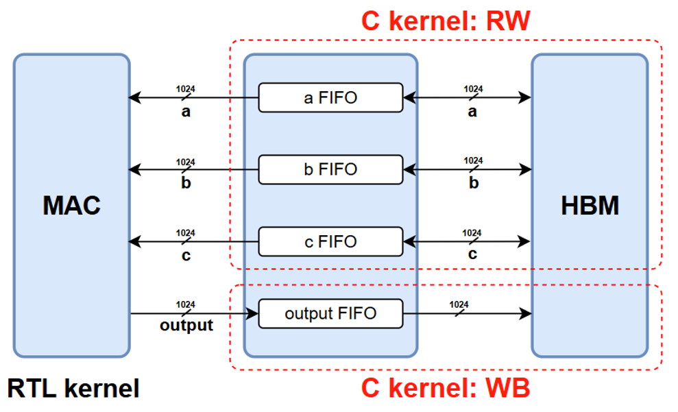

# Connect_RTL_Kernel_and_C_Kernel

***Version: Vitis 2022.2***

Board: `xilinx_u280_gen3x16_xdma_1_202211_1`

---

***To actually run this project, the Makefile will need substantial changes;***

***Please modify it according to your own environment.***

## Project Objective

This project focuses on how to connect RTL kernels and C kernels via AXI-Stream protocol in Vitis 2022.2

**Step 1 : [RTL_Kernel_Creation](https://github.com/tuhao-arstia/Vitis_Project/tree/main/Connect_RTL_kernel_and_C_Kernel/RTL_Kernel_Creation)**
  
Tutorial for creating RTL kernel file(.xo) with user RTL logic through Vitis and Vivado.

**Step 2 : [Vitis](https://github.com/tuhao-arstia/Vitis_Project/tree/main/Connect_RTL_kernel_and_C_Kernel/Vitis)**

Project setup files. You can simply run the project here.

## Project Architecture

