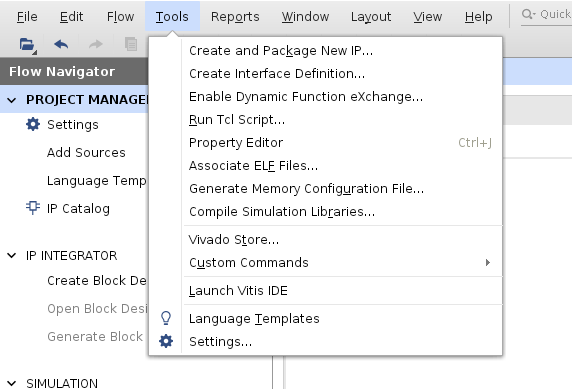
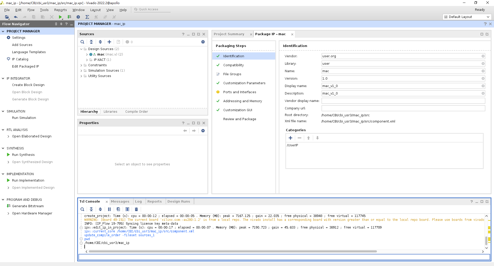
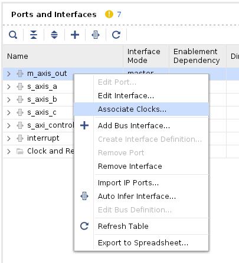
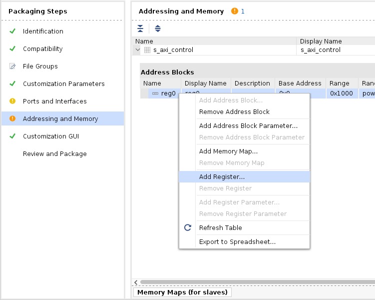
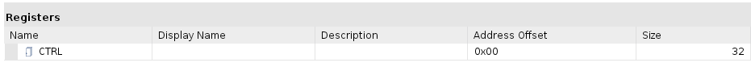

# Packaging RTL Kernel 

Make sure these files are prepared:

```
src/
├── mac.v                (Top-level wrapper)
├── mac_control_s_axi.v  (Control interface)
└── mac_rtl.v            (User logic implementation)
```

## Create a New Vivado Project

Create a new directory `mac_ip` and launch the Vivado GUI there.

(1) **Create Project**

(2) **Project Name**

- Do nothing. Click **Next**

(3) **Project Type**

- Do nothing. Click **Next**

(4) **Default Part** 

- `Boards` > `Alveo U280 Data Center Accelerator Card`
- Click **Next**

(5) **New Project Summary**

- Click **Finish**

## Preparation

**Upload the `src` directory and `ip_package.tcl` to the `mac_ip` directory.**

Select `Tools` > `Create and Package New IP ...`



(1) **Packaging Options**

- Choose **Package a specified directory**
- Click **Next**

(2) **Package a Specified Directory**

- Choose the uploaded `src` directory.

(3) **Edit in IP Packager Project Name** : 

- Project name : `mac_ip`
- Project location : Choose the same uploaded `src` directory
- Click **Next**

(4) Click **Finish**. A whole new project window will open soon.



## Packaging

[Reference](https://github.com/Xilinx/Vitis-Tutorials/blob/2022.2/Hardware_Acceleration/Feature_Tutorials/01-rtl_kernel_workflow/package_ip.md#open-the-ip-packager)

All these steps mentioned later are equivalent to the command in `ip_package.tcl`. 

You can simply source `ip_package.tcl` in the Vivado Tcl Console.

- **Identification** : No modifications. You can ignore this part.
    ```
    [Tcl Console]
    set_property vendor fpga_demo [ipx::current_core]
    set_property display_name mac_kernel [ipx::current_core]
    set_property description mac_kernel_v3 [ipx::current_core]
    ```
- **Compatibility** :
  - (✓) Package for Vitis 
    - Control protocol: `ap_ctrl_hs`
  - (✓) Ignore Freq_Hz 

- **Ports and Interfaces**
  - Associate ap_clk for every AXI interfaces.
    - Right click on one AXI protocol interface > **Associate Clocks**
    - 
    - (✓) ap_clk and click **OK**
    ```
    [Tcl Console]
    ipx::associate_bus_interfaces -busif m_axis_out -clock ap_clk [ipx::current_core]
    ipx::associate_bus_interfaces -busif s_axis_a -clock ap_clk [ipx::current_core]
    ipx::associate_bus_interfaces -busif s_axis_b -clock ap_clk [ipx::current_core]
    ipx::associate_bus_interfaces -busif s_axis_c -clock ap_clk [ipx::current_core]
    ipx::associate_bus_interfaces -busif s_axi_control -clock ap_clk [ipx::current_core]
    ipx::associate_bus_interfaces -clock ap_clk -reset interrupt [ipx::current_core]
    ```

- **Addressing and Memory**
  - Add a control register for control interface.
    - Right click on `reg0` > **Add Register**
    - 
    - Enter the name of the new Register: `CTRL` > **OK**
    - Address Offset: `0x00`
    - Size: `32`
    - 

    ```
    [Tcl Console]
    ipx::add_register CTRL [ipx::get_address_blocks reg0 -of_objects [ipx::get_memory_maps s_axi_control -of_objects [ipx::current_core]]]
    set_property address_offset 0x00 [ipx::get_registers CTRL -of_objects [ipx::get_address_blocks reg0 -of_objects [ipx::get_memory_maps s_axi_control -of_objects [ipx::current_core]]]]
    set_property size 32 [ipx::get_registers CTRL -of_objects [ipx::get_address_blocks reg0 -of_objects [ipx::get_memory_maps s_axi_control -of_objects [ipx::current_core]]]]
    ```

- **Review and Package**
  - **After Packaging** > **Edit packaging settings** >> (✓) **Create archive of IP**
  - Press **Package IP**.

## Congratulations !!!

Now the generated Vitis kernel file (`mac.xo`) appears in `mac_ip/xo` !!!