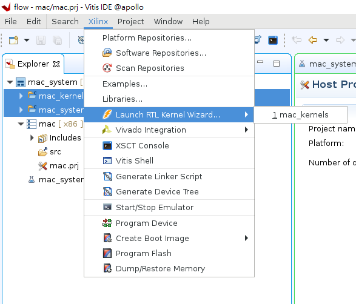
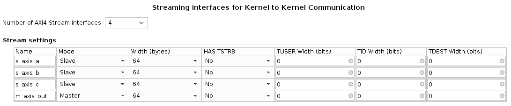
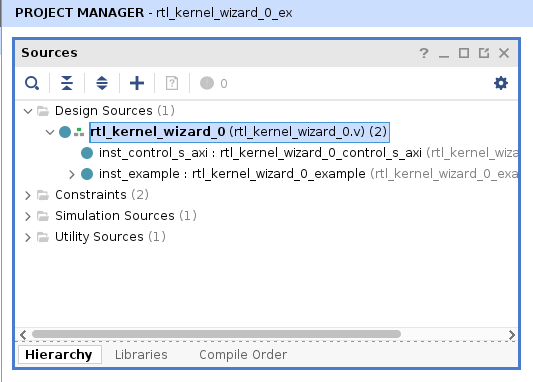

# Generating RTL Template 

## Create a New Vitis Project

Launch the Vitis GUI. Define the Workspace by yourself.
   
(1) **Create Application Project**
        
(2) Select the platform : `xilinx_u280_gen3x16_xdma_1_202211_1`, and click **Next**.

(3) Application project name : `mac`, and click **Next**.

(4) Template : `Empty Application (XRT Native API's)`, and click **Finish**.

The project window will appear like below.

## Configure the RTL Kernel Wizard
 
Select `Xilinx` > `Launch RTL Kernel Wizard` > `1 mac_kernels`

Based on User RTL I/O definition, complete the settings. 

Please refer to my project architecture.

(1) **General Settings** :

- Kernel control interface : `ap_ctrl_hs`

- Number of clocks : 1

- Has reset : 1 

(2) **Scalars** :

- Number of scalar kernel input arguments : 0

(3) **Global Memory** :

- Number of AXI master interfaces : 0

(4) **Streaming interfaces for Kernel to Kernel Communication** :

- Number of AXI4-Stream interfaces : 4
  
    > Note: Vivado 2022.2 does not support 128-byte data width in the wizaed, but it can be modified after generating the template.

(5) **Summary** :

- Check everything here and click **OK**. Wait for the Vivado 2022.2 GUI to launch.

## Retrieve & Modify the Generated Template Files

All the template files needed are in the `Sources` block now:

